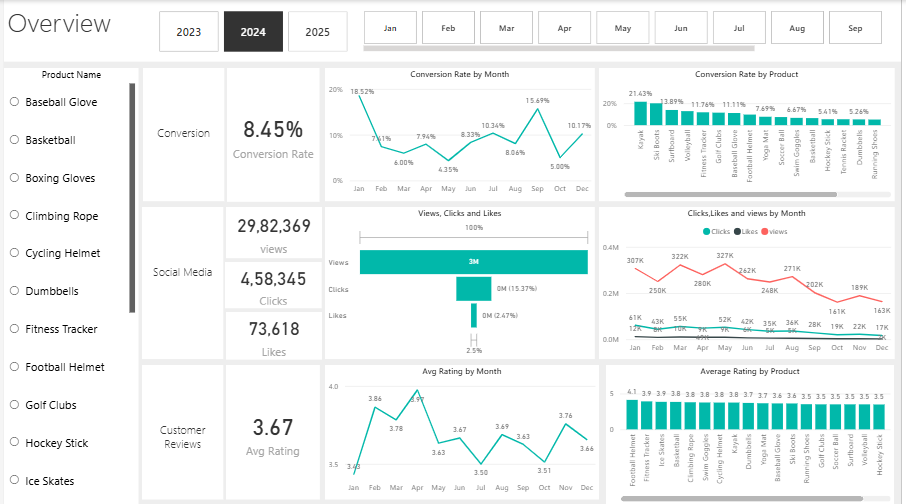
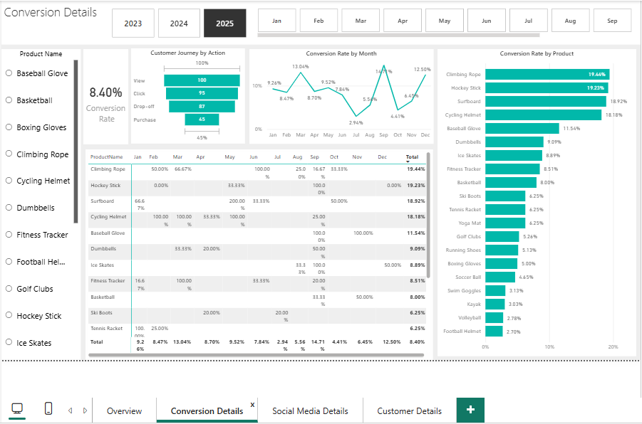
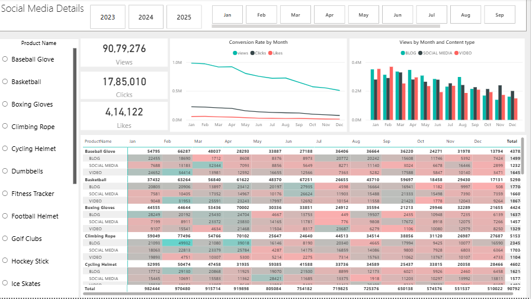
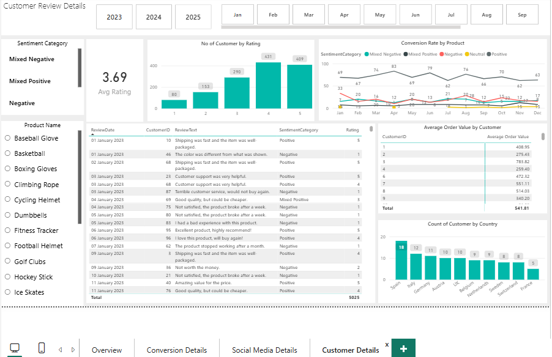

# 🛍️ ShopEasy — Marketing Analytics Business Case

> End-to-end marketing analytics project: diagnosing why an online retailer's conversion rates and customer engagement are declining despite increased marketing spend, and translating data into actions the business can ship.


<br>

## 📑 Table of Contents

1. [Project Overview](#1-project-overview)
2. [Problem Statement](#2-problem-statement)
3. [Dataset Description](#3-dataset-description)
4. [Methodology](#4-methodology)
5. [Key Findings](#5-key-findings)
6. [Recommendations](#6-recommendations)
7. [Technical Implementation](#7-technical-implementation)
8. [Deliverables](#8-deliverables)
9. [Sources & References](#9-sources--references)
10. [How to Explore](#10-how-to-explore)

<br>

---

<br>

## 1. Project Overview

ShopEasy, an online retail business, has launched several new marketing campaigns over the past year — yet customer engagement is falling, conversion rates are inconsistent, and marketing spend is no longer producing the returns leadership expects.

This project takes the full raw operational data, cleans and models it, surfaces the root causes through a layered analysis (**conversion → engagement → feedback**), and ends with a Power BI dashboard plus a prioritized action plan.

The work covers the entire analyst workflow — business framing, data engineering in SQL, sentiment scoring in Python, dashboarding, and a stakeholder-ready summary deck — and is structured so a reviewer can follow the reasoning from the original problem statement all the way to the final recommendations.

| Field | Detail |
| :--- | :--- |
| **Role** | Data Analyst (solo project) |
| **Duration** | ~3 weeks |
| **Stack** | SQL Server · Python (pandas, NLTK/VADER) · Power BI · PowerPoint |
| **Domain** | E-commerce · Marketing Analytics |

<br>

---

<br>

## 2. Problem Statement

ShopEasy is facing reduced customer engagement and falling conversion rates despite launching several new online marketing campaigns. Leadership has asked for a detailed analysis to pinpoint where the funnel is breaking and where marketing budget is being wasted.

**Four issues were named in the brief:**

- **Reduced customer engagement** — interactions with the site and marketing content have declined.
- **Decreased conversion rates** — a smaller share of visitors are turning into paying customers.
- **High marketing expenses** — significant investment is not yielding the expected return.
- **Need for customer feedback analysis** — there is no structured view of what customers are actually saying about products and services.

The business agreed on four KPIs to anchor the analysis:

> 📊 **Conversion Rate** &nbsp;·&nbsp; **Customer Engagement Rate** &nbsp;·&nbsp; **Average Order Value (AOV)** &nbsp;·&nbsp; **Customer Feedback Score**

<br>

---

<br>

## 3. Dataset Description

The dataset is a relational set of tables exported from ShopEasy's operational systems, covering **one full calendar year** of customer, product, marketing, and feedback activity.

| Table | What's in it | Why it matters |
| :--- | :--- | :--- |
| `customers` | Customer ID, demographics, geography | Segmentation and cohort analysis |
| `products` | Product ID, category, price | Links revenue and conversion back to product lines |
| `customer_journey` | Sessions, page visits, stage, action, conversion flag | Source of the conversion-rate calculation |
| `engagement_data` | Content ID, content type, views, clicks, likes | Drives engagement, CTR, and content-mix analysis |
| `customer_reviews` | Review ID, product ID, rating (1–5), free-text review | Feeds the rating distribution and sentiment model |
| `geography` | Country, region lookup | Joins to customers for geo cuts |

> ⚠️ The data needed real cleaning before any analysis — duplicate reviews, inconsistent casing in content types, nulls in the review text, and date fields that needed to be standardized.

<br>

---

<br>

## 4. Methodology

The work followed five stages, each handing clean outputs to the next.

### 1️⃣ &nbsp;Frame the question
Translated the four business pain points into measurable KPIs and confirmed what *"good"* looks like for each (e.g., customer rating target of 4.0).

### 2️⃣ &nbsp;Clean and shape the data in SQL
Removed duplicate reviews, normalized content type labels, filled missing review text where safe, joined journey events to products, and built the analytical views used by Power BI.

### 3️⃣ &nbsp;Sentiment analysis in Python
Ran the customer review text through **VADER (NLTK)** to classify each review as *positive / negative / mixed-positive / mixed-negative / neutral*. This gave a sentiment layer on top of the star rating, since a 3-star review and a 5-star review can both contain useful complaints.

### 4️⃣ &nbsp;Build the dashboard in Power BI
One dashboard per KPI theme — **Conversion, Engagement, Feedback** — with month-level and product-level drill-downs. DAX measures handle the rolling conversion rate, click-through rate, and rating distribution.

### 5️⃣ &nbsp;Synthesize and recommend
Pulled the three threads together into a single narrative: where the funnel breaks, which content actually works, and which customer concerns to act on first.

<br>

---

<br>

## 5. Key Findings

### 📉 &nbsp;Conversion rates are volatile, not flat

Conversion swung from a high of **18.5% in January** (driven almost entirely by Ski Boots at a remarkable 150% conversion — clear seasonal demand) to a low of **4.3% in May**, with another dip to **5.0% in October** before recovering to **10.2% in December**.

> The pattern is **seasonal, not random** — and the low-conversion months currently have no targeted campaign behind them.

### 📊 &nbsp;Engagement is genuine but shrinking

Views peaked in February and July and then declined steadily from August onward. Clicks and likes are low relative to views, but the **click-through rate of 15.37%** shows that the audience who *does* engage is engaging meaningfully.

> The problem is **reach and retention**, not interest quality. Blog content drove the most views (April and July peaks); social and video held steady at lower levels.

### ⭐ &nbsp;Customer feedback is positive on average but stuck below target

The average rating sits at **~3.7 against a 4.0 target**, and has barely moved across the year.

| Rating | Reviews |
| :---: | :---: |
| ⭐⭐⭐⭐⭐ | 135 |
| ⭐⭐⭐⭐ | 140 |
| ⭐⭐ | 57 |
| ⭐ | 26 |

Sentiment analysis confirms the same picture: **275 positive reviews**, **82 negative**, plus a meaningful block of mixed-sentiment reviews where the customer liked the product but flagged specific issues — **the most actionable segment**.

<br>

---

<br>

## 6. Recommendations

Three priorities, in order of expected impact on revenue.

### 🎯 &nbsp;1. Lift conversion in the soft months

Don't try to flatten the seasonal curve — exploit it. Run targeted seasonal campaigns and personalized offers in **January and September** for the categories already proven to convert (**Kayaks, Ski Boots, Baseball Gloves**), and build a specific intervention plan for **May and October** when conversion collapses.

> This is the fastest path to recovering wasted marketing spend.

### 🚀 &nbsp;2. Rebuild the content mix around what works

**Blog content is the engagement engine** — invest there first. Test interactive video and user-generated content to lift the August–December slump, and re-position calls-to-action in the formats that already get the clicks.

> The 15.37% CTR proves the creative is working when it reaches the right audience; the gap is **distribution and frequency, not message**.

### 💬 &nbsp;3. Close the loop on mixed and negative feedback

Build a feedback triage process:

- Route mixed reviews to product teams for the specific concern raised
- Follow up directly with 1- and 2-star reviewers
- Track whether the customer updates their rating

> Even a modest lift on the long tail moves the average from **3.7 toward the 4.0 target** — and converts the silent dissatisfied segment into either repeat buyers or honest churn data.

<br>

---

<br>

## 7. Technical Implementation

### 🗄️ &nbsp;SQL Server &nbsp;— &nbsp;*Data preparation layer*

Cleaning scripts deduplicated `customer_reviews`, normalized `content_type` values in `engagement_data`, and standardized date formats. Analytical views joined journey events to products and pre-aggregated monthly conversion and engagement metrics so Power BI could read clean, denormalized tables.

### 🐍 &nbsp;Python &nbsp;— &nbsp;*Sentiment scoring*

Reviews were loaded with `pandas`, scored with **VADER** from `NLTK`, and bucketed into five sentiment categories. The scored output was written back to SQL Server as `fact_review_sentiment` and joined to the original review table on `review_id`.

### 📊 &nbsp;Power BI &nbsp;— &nbsp;*Presentation layer*

Three report pages — **Conversion**, **Engagement**, **Feedback** — each driven by a dedicated DAX measure set:













- Conversion rate measure uses a **rolling monthly denominator**
- Rating distribution uses a **calculated dimension** so the histogram updates with filters
- Slicers cover **month, product category, and content type**

### 📑 &nbsp;PowerPoint &nbsp;— &nbsp;*Executive summary*

A six-slide deck designed to be read in five minutes without opening the dashboard — included in this repo.

<br>

---

<br>

## 8. Deliverables

```
ShopEasy-Marketing-Analytics/
│
├──SQL Queries
│
├── Python sentiment_analysis code
│
├──Marketing_Analytics_Dashboard_Presentation.pptx
│
├─  business_case.pptx
│
└── 📄 README.md
```

<br>

---

<br>

## 9. Sources & References

- **Business case** — ShopEasy internal brief (see [`/docs/business_case.pdf`](docs/business_case.pdf))
- **Data** — ShopEasy operational database export (customers, products, journey, engagement, reviews, geography)
- **Sentiment model** — Hutto, C.J. & Gilbert, E.E. (2014). *VADER: A Parsimonious Rule-based Model for Sentiment Analysis of Social Media Text.* Eighth International Conference on Weblogs and Social Media (ICWSM-14).
- **Tooling docs** — [Microsoft Power BI][(https://learn.microsoft.com/power-bi/)](https://app.powerbi.com/links/FpZYwPzUIM?ctid=3d571b57-bc68-4a84-8dca-37627724762c&pbi_source=linkShare) · [NLTK VADER](https://www.nltk.org/api/nltk.sentiment.vader.html) · [SQL Server T-SQL](https://learn.microsoft.com/sql/t-sql/)

<br>

---

<br>

## 10. How to Explore

### ⏱️ &nbsp;If you have 10 minutes

Read the **slide executive summary** in [Business Problem Statement presentation](marketing_analytics_business_case.pptx)  and  [Solution Overview Presentation](marketing_analytics_dashboard_presentation) — it covers the full story from problem to recommendations.

### ⏱️ &nbsp;If you have 30 minutes

Open `ShopEasy_Dashboard.pbix` in Power BI Desktop and walk the three report pages. Start on **Conversion**, then **Engagement**, then **Feedback** — that's the same order the analysis was built in.

### ⏱️ &nbsp;If you want to see the underlying work

```bash
# 1. Rebuild the cleaned tables and views
sqlcmd -S <server> -d <database> -i sql/01_clean_customers.sql
sqlcmd -S <server> -d <database> -i sql/02_clean_reviews.sql
sqlcmd -S <server> -d <database> -i sql/03_clean_engagement.sql
sqlcmd -S <server> -d <database> -i sql/04_reporting_views.sql

# 2. Run the sentiment notebook
jupyter notebook python/sentiment_analysis.ipynb

# 3. Refresh the Power BI file against your local database connection
```

<br>

---

<br>

### 📬 &nbsp;Contact

Questions, suggestions, or interview requests are welcome — reach me through the contact link in my profile.

<br>

<p align="center">
  <i>Built with curiosity.
</p>
